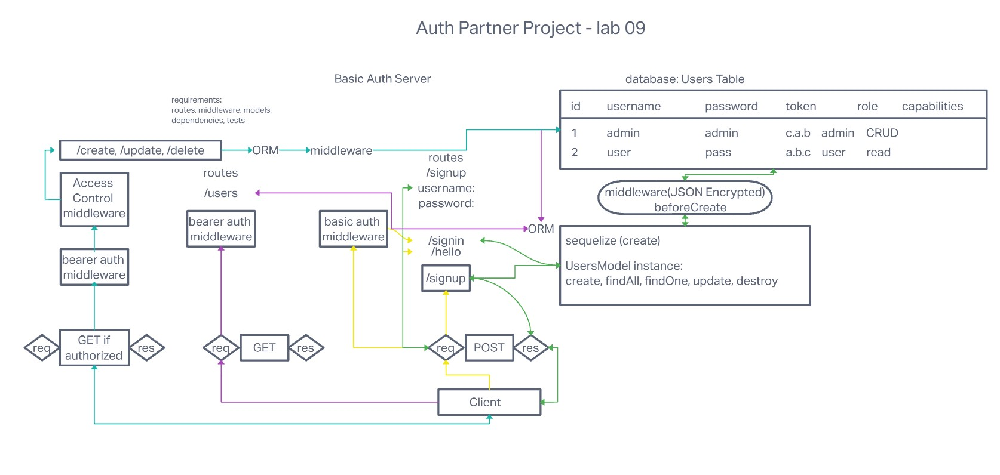

# Code 401d48 lab 09

## Author: Robert Ball | Alan Chelko

### Problem Domain

* Create a new application using your API Server and Authentication System

Deployed production server: [Heroku - rb-ac lab09 API](https://rb-ac-lab-09.herokuapp.com/)

---
Requirements:

* API/Auth server must be deployed
* Use of your API server to perform database operations
* Use of login/auth/acl to control access to your resources

---

Documentation:



Dependencies

```JSON
{
  "base-64": "^1.0.0",
  "bcrypt": "^5.0.1",
  "cors": "^2.8.5",
  "dotenv": "^16.0.2",
  "eslint": "^8.24.0",
  "express": "^4.18.1",
  "jest": "^29.0.3",
  "jsonwebtoken": "^8.5.1",
  "morgan": "^1.10.0",
  "nodemon": "^2.0.20",
  "pg": "^8.8.0",
  "sequelize": "^6.23.1",
  "sequelize-cli": "^6.4.1",
  "sqlite3": "^5.1.1",
  "supertest": "^6.2.4"
}
```

Setup

1. Create repo or fork this repo
2. Add README
3. Add .gitignore for Node
4. Add the license of your choice
5. Clone repo to your local system
6. with the repo open in your editor of choice, run:

```code
npm init -y
install dependencies
```

